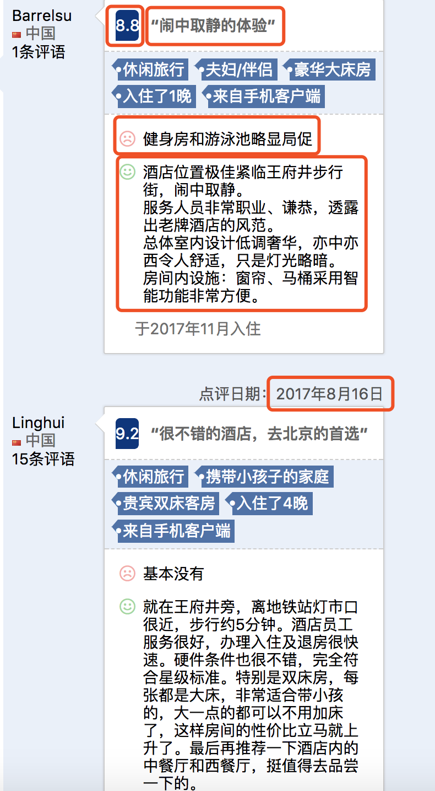
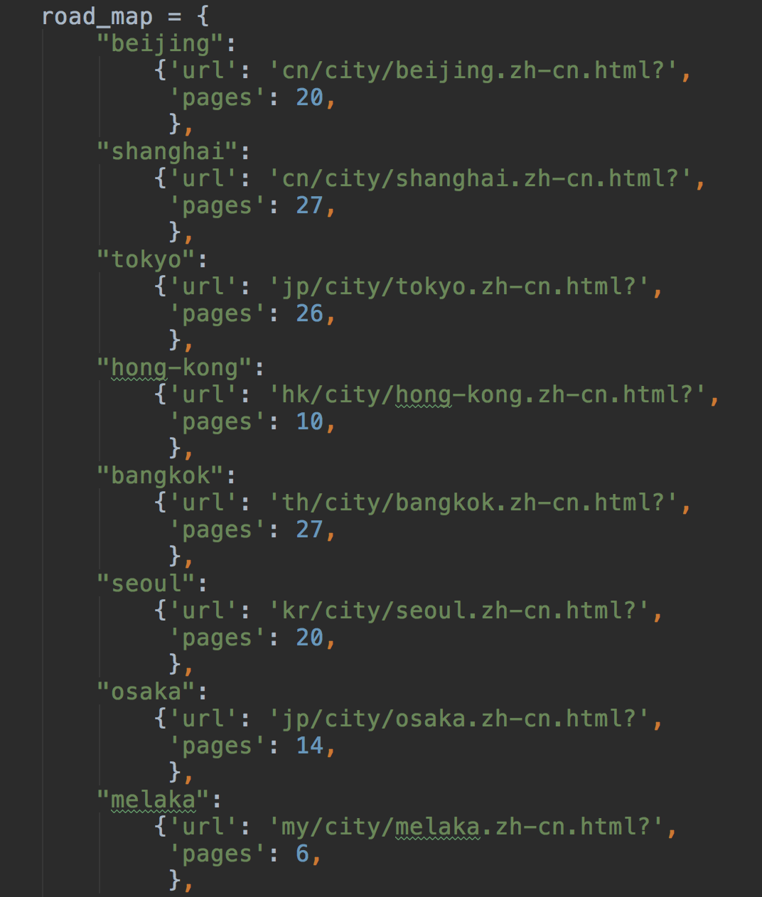

# scrapy爬取酒店评论数据

--
代码 here：[GitHub：]()
--
采用scrapy爬取酒店评论数据。

总共有28W条记录。

做某NLP任务，需要一些hotel reviews, 选择从`www.booking.com`搞一点数据来。
根据主页显示总共有20个城市from diferrent countries，每个城市下有若干个酒店，每个酒店下若干条评论。

#〇、数据源介绍

数据源：`www.booking.com`  
具体：

### *所有的城市：*

### *某个城市的酒店列表：*

### *某个酒店的评论：*

<!-------->

#一、爬取数据项：
设定一条记录有如下字段：  

* 目标酒店名target  
* 分数score  
* 总体评价overall_comment  
* 正评论positive_comment  
* 负评论negative_comment  
* 入住日期date  
* 城市名city_name

用CSV文件保存with seperator "\t".

#二、目录介绍：

-hotel_review_booking：hotel_data数据文件  
&nbsp;&nbsp;-hotel_review_booking：scrapy理解的项目目录  
&nbsp;&nbsp;&nbsp;&nbsp;&nbsp;&nbsp;&nbsp;&nbsp;-hotel_review_booking：scrapy的真正项目目录  
&nbsp;&nbsp;&nbsp;&nbsp;&nbsp;&nbsp;&nbsp;&nbsp;-entrypoint  
&nbsp;&nbsp;&nbsp;&nbsp;&nbsp;&nbsp;&nbsp;&nbsp;……

#三、流程：四步：

* 新建项目 (Project)：新建一个新的爬虫项目
* 明确目标（Items）：明确你想要抓取的目标
* 制作爬虫（Spider）：制作爬虫开始爬取网页
* 存储内容（Pipeline）：设计管道存储爬取内容

#四、url分析：

略……

#五、代码提示：

1. 因为酒店列表不好直接显示页数，所以采取半人工手段标记页数……
	

2. 日期date: 使用正则匹配。

	`pattern = r'(\d{4})年(\d{1,2})月(\d{1,2})日'`
	`pattern_compiled = re.compile(pattern)`

3. 其他也没啥的，就是scrapy的使用上，纯经验主义。